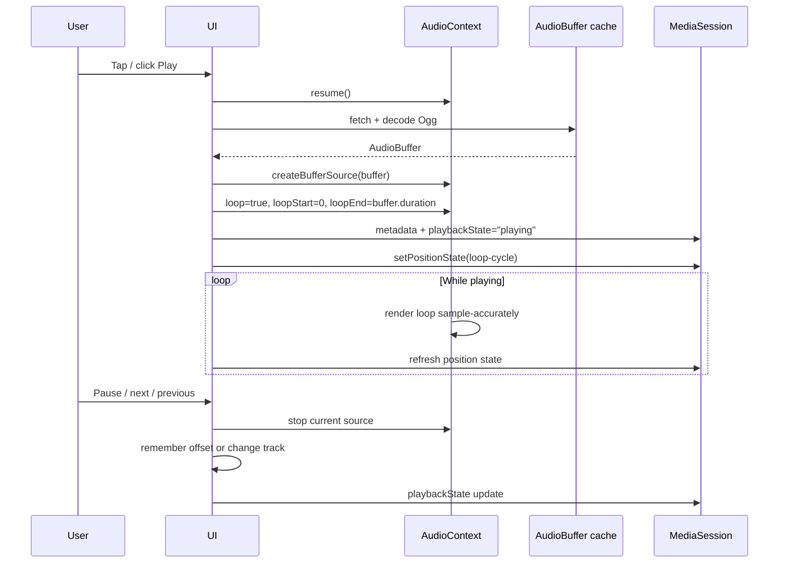
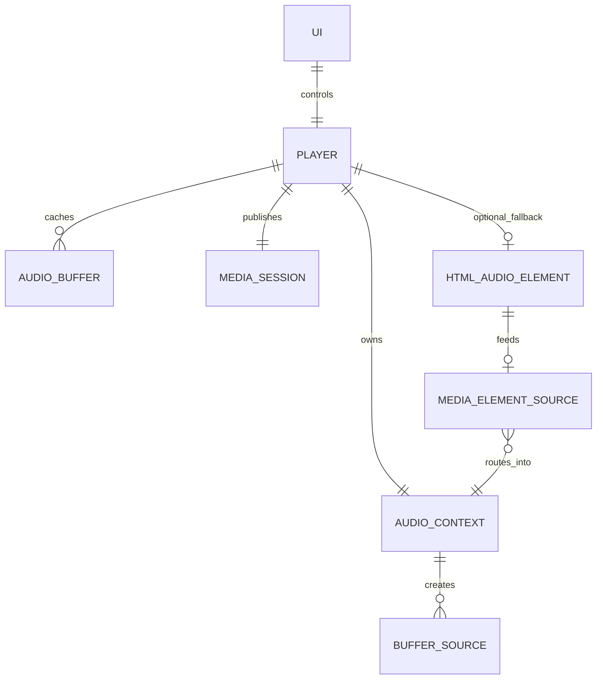

# Gapless Ogg Ambient Looping in a Native Web App

## Executive summary

For a modern 2026 web app that must loop short ambient samples as cleanly as possible, the best primary playback engine is the entity["software","Web Audio API","web API"] using pre-decoded `AudioBuffer`s and `AudioBufferSourceNode`. This is the only mainstream web playback path whose specification explicitly promises sample-accurate scheduled playback, and `AudioBufferSourceNode` looping also supports subsample-accurate loop endpoints. By contrast, the native `<audio loop>` path is simple and OS-friendly, but its contract is only that playback “start over” at the end; it is not the standards-backed route for deterministic gapless looping. citeturn19view0turn20view1turn5view8

For media keys, lock-screen controls, headset buttons, keyboard play/pause, and notification-area controls, the right modern web stack is the entity["software","Media Session API","web API"], with explicit `setActionHandler()`, `metadata`, `playbackState`, and, for custom playback engines like Web Audio, `setPositionState()`. The specification is explicitly about platform media controls and hardware keys, and MDN notes that `setPositionState()` is especially useful when your player is not directly browser-managed media. citeturn7view3turn35view0turn5view10turn36view0

For codec choice, Ogg is a container, not a codec. Within Ogg, prefer **Opus** over **Vorbis** for new work unless you have a specific reason not to. Ogg Opus has explicit pre-skip and end-trimming semantics for sample-accurate cropping and gapless playback; Vorbis can also trim accurately, but its start/end handling is more subtle because it relies on Vorbis granule-position rules and overlap/add behaviour. Modern entity["software","Safari","web browser"] only gained Ogg Opus/Vorbis support in version 18.4 on macOS 15.4, entity["software","iOS","mobile operating system"] 18.4 and related platforms, so your “modern only” assumption matters here. citeturn17view1turn16view2turn18view0turn5view3turn29view0

The important caveat is platform integration on iPhone and iPad. The audio-session model currently treats `HTMLMediaElement` as `playback` by default, but `AudioContext` as `ambient` by default. Historically, WebKit has explicitly said that Web Audio is treated as ambient audio on iOS and is blocked once the app is no longer foreground, while `<audio>`-based background playback in standalone apps was fixed in iOS 15.4. That means the most robust overall design is **two-tiered**: use Web Audio as the main engine for perfect loops, and layer Media Session plus progressive enhancement with `navigator.audioSession.type = "playback"` on top; if a specific iOS/PWA deployment proves that lock-screen or background reliability matters more than mathematically perfect loop joins, keep a hybrid `<audio>`-based fallback mode available. citeturn6view0turn6view1turn37view0turn25view1turn38search1

## Recommended architecture

The recommended architecture is:

1. **Primary engine:** fetch Ogg, decode once with `decodeAudioData()`, and loop the resulting `AudioBuffer` with `AudioBufferSourceNode.loop = true`.
2. **Transport layer:** implement your own play, pause, resume, next, previous, and track-position bookkeeping; `AudioBufferSourceNode` is one-shot, so every play/resume creates a fresh node.
3. **OS integration layer:** use Media Session for metadata and action callbacks, set `playbackState` yourself, and publish loop-cycle position with `setPositionState()`.
4. **Audio-focus layer:** if available, set `navigator.audioSession.type = "playback"` before starting playback, because the default automatic behaviour differs between media elements and Web Audio.
5. **Fallback mode:** if background iOS/PWA behaviour or lock-screen transport proves flaky in your exact deployment, fall back to a real `<audio>` / hybrid path for that environment. citeturn22search0turn20view5turn35view0turn36view0turn37view0turn6view2

A key detail: do **not** try to “fake” OS media integration with a permanently-muted silent `<audio>` element while real sound comes only from Web Audio. The Media Session model recommends user agents infer playback state by monitoring media elements, and the Audio Session model considers an `HTMLMediaElement` “audible” only when it is playing, has audio tracks, is not muted, and its volume is not zero. A dummy silent anchor is therefore not a robust basis for media-key routing. citeturn7view1turn6view0



## Approach comparison

| Approach | Gaplessness | Complexity | Battery / CPU | iOS / mobile reliability | Media-key support | Memory | Summary |
|---|---|---:|---|---|---|---|---|
| Native `<audio loop>` | Variable | Low | Usually good | Usually best for background / lock screen | Strong with Media Session | Low | Excellent transport integration, but not the standards-backed choice for deterministic gapless looping. citeturn5view8turn7view1turn6view0 |
| Web Audio `AudioBufferSourceNode` | Best | Medium | Good after one-time decode, but decoded buffers cost RAM | Strong in foreground; background on iOS has historically been weaker | Good if you drive Media Session explicitly | High | Best choice for perfect loop joins; own transport required; recreate sources on resume. citeturn19view0turn20view1turn20view5turn25view1 |
| Hybrid `<audio>` + `createMediaElementSource()` | Near-gapless, not mathematically exact | High | Medium | Best fallback for OS/session-heavy cases | Strong | Medium | Useful when you need real media-element session semantics and Web Audio mixing/fades, but overlap/crossfade is a masking strategy, not true sample-perfect looping. citeturn21search0turn21search3turn6view0turn35view0 |
| WebCodecs + own Ogg demuxer | Potentially excellent | Very high | Variable | Operationally less attractive here | Fully manual | Medium-high | Not recommended for this product: WebCodecs is low-level, limited-availability, and provides no built-in mux/demux layer. citeturn30search0turn27search8turn26search1turn5view13 |

The practical conclusion is simple. If your top priority is the *cleanest possible loop seam*, use Web Audio first. If your top priority is *the most native-feeling background playback and lock-screen controls on iOS*, `<audio>` is still the safer operational primitive. For a soundscape product, that usually leads to a primary Web Audio engine plus a hybrid or media-element fallback for specific environments. citeturn19view1turn25view1turn37view0

## Codec and export guidance

### Ogg container and codec choice

| Topic | Ogg Opus | Ogg Vorbis |
|---|---|---|
| Container support in modern Safari | Supported from Safari 18.4 / iOS 18.4+ | Supported from Safari 18.4 / iOS 18.4+ |
| Start trimming | Explicit `pre-skip` field | Uses Vorbis granule-position trimming rules |
| End trimming | Explicit end trimming via final granule position | Explicit via final granule position |
| Internal sample-rate semantics | Granule positions are always in 48 kHz PCM units | Uses PCM sample positions directly |
| Loop-authoring simplicity | Better for exact trimming and modern tooling | More nuanced because of overlap/add and first-page rules |
| Recommendation | **Preferred** | Acceptable if already in your pipeline |

Sources: citeturn5view3turn29view0turn17view1turn17view2turn16view2turn18view0

For this product, **Ogg Opus is the better default**. The key reason is not just compression efficiency; it is the clarity of its playback model. The Ogg Opus spec defines `pre-skip` explicitly, defines PCM position as `granule position - pre-skip`, and allows explicit end trimming on the final page. It also states that the “input sample rate” metadata is **not** the playback rate, and recommends 48 kHz playback where supported. Vorbis can still be gapless, but its trimming model is tied more tightly to Vorbis/Ogg page structure and overlap/add constraints, which makes it less pleasant when you are trying to reason about exact loop boundaries. citeturn17view1turn17view2turn16view2turn18view0

### Encoding and export settings

For seamless loops, the most important work happens **before** encoding:

- Author the loop in PCM first, with exact sample boundaries. The loop should already be seamless before compression.
- Prefer **48 kHz masters** when targeting Opus, because Ogg Opus granule positions and recommended playback behaviour are defined around 48 kHz. citeturn17view2turn16view5
- Use **20 ms Opus frames** if your encoder exposes that setting; the Opus FAQ says 20 ms is the general sweet spot, and larger frame sizes usually hurt file-encoding quality at a given bitrate. citeturn15search0
- Keep **output gain at zero** in the Opus header where possible; the RFC says muxers should generally apply gain before encoding rather than rely on post-decode output gain metadata. citeturn17view1
- If you need to crop already-encoded Opus files, do it with tooling that preserves **pre-skip** and **end trimming** correctly. Do **not** naïvely byte-trim or page-trim Ogg files. citeturn16view0turn16view2
- If a sound has a natural reverb tail that does **not** land cleanly at the loop point, do not expect codec metadata to “fix” that. Either redesign the loop, make the loop longer, or use a deliberate artistic crossfade. citeturn20view1turn18view0

One subtle but important browser-side consequence is that `decodeAudioData()` resamples into the `AudioContext` sample rate. That means your runtime loop length should always come from the decoded `AudioBuffer.duration`, not from file metadata or assumptions about the original asset rate. citeturn22search0turn22search2

## Implementation patterns

### Web Audio gapless loop from decoded Ogg

This is the recommended baseline. It decodes the whole Ogg file once, stores it in memory, and loops the decoded PCM with a fresh source node every time you play or resume. That matches the Web Audio model: `AudioBufferSourceNode` is cheap, reusable buffers are normal, and the node itself is one-shot. citeturn20view5turn19view1

```html
<script type="module">
class GaplessLoopPlayer {
  constructor(tracks) {
    this.tracks = tracks;              // [{ src, title, artist, artwork }]
    this.index = 0;
    this.ctx = null;
    this.masterGain = null;
    this.buffers = new Map();

    this.source = null;
    this.startedAt = 0;                // AudioContext time - offset
    this.offset = 0;                   // seconds within current loop
    this.positionTimer = 0;
  }

  async ensureContext() {
    if (!this.ctx) {
      this.ctx = new AudioContext();
      this.masterGain = this.ctx.createGain();
      this.masterGain.connect(this.ctx.destination);

      this.ctx.addEventListener("statechange", () => {
        this.syncMediaSession();
      });

      document.addEventListener("visibilitychange", async () => {
        if (!document.hidden && this.isPlaying() && this.ctx.state !== "running") {
          try { await this.ctx.resume(); } catch {}
          this.syncMediaSession();
        }
      });
    }

    if ("audioSession" in navigator) {
      try {
        navigator.audioSession.type = "playback"; // progressive enhancement
      } catch {}
    }

    if (this.ctx.state !== "running") {
      await this.ctx.resume();
    }

    this.installMediaSession();
  }

  async preload(index) {
    if (this.buffers.has(index)) return this.buffers.get(index);

    const response = await fetch(this.tracks[index].src, { cache: "force-cache" });
    const arrayBuffer = await response.arrayBuffer();
    const audioBuffer = await this.ctx.decodeAudioData(arrayBuffer);
    this.buffers.set(index, audioBuffer);
    return audioBuffer;
  }

  isPlaying() {
    return !!this.source;
  }

  currentBuffer() {
    return this.buffers.get(this.index) ?? null;
  }

  currentPosition() {
    const buffer = this.currentBuffer();
    if (!buffer) return 0;
    if (!this.isPlaying()) return this.offset;
    return (this.ctx.currentTime - this.startedAt) % buffer.duration;
  }

  installMediaSession() {
    if (!("mediaSession" in navigator)) return;

    const safe = (action, handler) => {
      try {
        navigator.mediaSession.setActionHandler(action, handler);
      } catch {}
    };

    safe("play", () => this.play());
    safe("pause", () => this.pause());
    safe("nexttrack", () => this.next());
    safe("previoustrack", () => this.previous());

    this.syncMediaSession();
  }

  syncMediaSession() {
    if (!("mediaSession" in navigator)) return;

    const track = this.tracks[this.index];
    navigator.mediaSession.metadata = new MediaMetadata({
      title: track.title,
      artist: track.artist ?? "",
      album: track.album ?? "",
      artwork: track.artwork ?? []
    });

    navigator.mediaSession.playbackState =
      this.isPlaying() && this.ctx?.state === "running" ? "playing" : "paused";

    const buffer = this.currentBuffer();
    if (buffer && navigator.mediaSession.setPositionState) {
      try {
        navigator.mediaSession.setPositionState({
          duration: buffer.duration,
          playbackRate:
            this.isPlaying() && this.ctx?.state === "running" ? 1 : 0,
          position: Math.min(this.currentPosition(), buffer.duration)
        });
      } catch {}
    }
  }

  startPositionTimer() {
    clearInterval(this.positionTimer);
    this.positionTimer = setInterval(() => this.syncMediaSession(), 1000);
  }

  stopPositionTimer() {
    clearInterval(this.positionTimer);
    this.positionTimer = 0;
  }

  createSource(offsetSeconds) {
    const buffer = this.currentBuffer();
    const source = this.ctx.createBufferSource();
    source.buffer = buffer;
    source.loop = true;
    source.loopStart = 0;
    source.loopEnd = buffer.duration;
    source.connect(this.masterGain);

    const clampedOffset = offsetSeconds % buffer.duration;
    source.start(this.ctx.currentTime, clampedOffset);

    this.startedAt = this.ctx.currentTime - clampedOffset;
    this.source = source;
  }

  stopSource() {
    if (!this.source) return;
    try { this.source.stop(); } catch {}
    this.source.disconnect();
    this.source = null;
  }

  async play() {
    await this.ensureContext();
    await this.preload(this.index);

    if (this.isPlaying()) return;

    this.createSource(this.offset);
    this.startPositionTimer();
    this.syncMediaSession();
  }

  async pause() {
    if (!this.ctx || !this.isPlaying()) return;

    this.offset = this.currentPosition();
    this.stopSource();
    this.stopPositionTimer();

    try { await this.ctx.suspend(); } catch {}
    this.syncMediaSession();
  }

  async switchTo(newIndex) {
    const wasPlaying = this.isPlaying();
    const wasRunning = this.ctx && this.ctx.state === "running";

    if (this.ctx && this.isPlaying()) {
      this.stopSource();
    }
    this.stopPositionTimer();

    this.index = (newIndex + this.tracks.length) % this.tracks.length;
    this.offset = 0;

    await this.ensureContext();
    await this.preload(this.index);

    if (wasPlaying && wasRunning) {
      this.createSource(0);
      this.startPositionTimer();
    } else {
      try { await this.ctx.suspend(); } catch {}
    }

    this.syncMediaSession();
  }

  async next() {
    await this.switchTo(this.index + 1);
  }

  async previous() {
    await this.switchTo(this.index - 1);
  }
}

// Example usage. Call from a real user gesture.
const player = new GaplessLoopPlayer([
  { src: "/audio/rain.ogg", title: "Rain", artist: "Soundscape" },
  { src: "/audio/fireplace.ogg", title: "Fireplace", artist: "Soundscape" }
]);

document.querySelector("#play").addEventListener("click", () => player.play());
document.querySelector("#pause").addEventListener("click", () => player.pause());
document.querySelector("#next").addEventListener("click", () => player.next());
document.querySelector("#prev").addEventListener("click", () => player.previous());
</script>
```

This pattern addresses the main pitfalls correctly: it resumes the context after a real gesture, recreates the source node on every play/resume, uses `buffer.duration` for loop length, updates Media Session explicitly, and suspends the context when paused to save battery. `visibilitychange` is also the right lifecycle hook here; `pagehide` is not reliably fired on mobile app-switching scenarios. citeturn21search2turn21search8turn20view5turn22search1turn24search0turn24search12

### Hybrid fallback using `<audio>` plus Web Audio gain control

This pattern is useful when you need **real media-element playback semantics** for OS transport controls and background audio, but you still want Web Audio mixing and gain ramps. It is a **fallback**, not the mathematically perfect loop strategy. The trick is to overlap two audio elements slightly and crossfade them through Web Audio. That masks restart seams, but it is not the same thing as a sample-perfect single decoded PCM loop. citeturn21search0turn21search3turn6view0turn25view1

```html
<script type="module">
const overlapSeconds = 0.120; // tune by ear; short enough not to smear ambience too much

const ctx = new AudioContext();
if ("audioSession" in navigator) {
  try { navigator.audioSession.type = "playback"; } catch {}
}

function makeTrackElement(src) {
  const el = new Audio(src);
  el.preload = "auto";
  el.loop = false;
  return el;
}

const elA = makeTrackElement("/audio/rain.ogg");
const elB = makeTrackElement("/audio/rain.ogg");

const srcA = ctx.createMediaElementSource(elA);
const srcB = ctx.createMediaElementSource(elB);

const gainA = ctx.createGain();
const gainB = ctx.createGain();

gainA.gain.value = 1;
gainB.gain.value = 0;

srcA.connect(gainA).connect(ctx.destination);
srcB.connect(gainB).connect(ctx.destination);

let active = { el: elA, gain: gainA };
let standby = { el: elB, gain: gainB };
let handoffTimer = 0;

function crossfadeToStandby() {
  standby.el.currentTime = 0;
  standby.el.play().catch(() => {});

  const t = ctx.currentTime;

  active.gain.gain.cancelScheduledValues(t);
  standby.gain.gain.cancelScheduledValues(t);

  active.gain.gain.setValueAtTime(active.gain.gain.value, t);
  standby.gain.gain.setValueAtTime(0, t);

  active.gain.gain.linearRampToValueAtTime(0, t + overlapSeconds);
  standby.gain.gain.linearRampToValueAtTime(1, t + overlapSeconds);

  setTimeout(() => {
    active.el.pause();
    active.el.currentTime = 0;
    [active, standby] = [standby, active];
    armHandoff();
  }, overlapSeconds * 1000 + 20);
}

function armHandoff() {
  clearTimeout(handoffTimer);
  if (!Number.isFinite(active.el.duration) || active.el.duration <= 0) return;

  const msUntilHandoff = Math.max(
    0,
    (active.el.duration - active.el.currentTime - overlapSeconds) * 1000
  );

  handoffTimer = setTimeout(crossfadeToStandby, msUntilHandoff);
}

async function playHybrid() {
  if (ctx.state !== "running") await ctx.resume();
  try {
    await active.el.play();
    armHandoff();

    if ("mediaSession" in navigator) {
      navigator.mediaSession.playbackState = "playing";
    }
  } catch (error) {
    console.error("Hybrid play failed:", error);
  }
}

function pauseHybrid() {
  clearTimeout(handoffTimer);
  active.el.pause();
  standby.el.pause();

  if ("mediaSession" in navigator) {
    navigator.mediaSession.playbackState = "paused";
  }
}

document.addEventListener("visibilitychange", async () => {
  if (!document.hidden && !active.el.paused && ctx.state !== "running") {
    try { await ctx.resume(); } catch {}
  }
});
</script>
```

Use this mode if you discover, by testing on actual iPhones or installed PWAs, that your product’s success depends more on lock-screen transport consistency than on mathematically exact loop joins. Also note that timers can be background-throttled in some environments, so this approach is best treated as an operational fallback rather than your canonical engine. citeturn24search0turn25view1turn25view4

### Optional WebCodecs pipeline

For this product, WebCodecs is **not the recommended route**. The API is low-level, MDN labels its audio decoder surface as limited availability, and MDN’s own documentation is explicit that WebCodecs handles codec I/O only and provides **no native muxing/demuxing**. For Ogg, that means you must either ship your own Ogg demuxer or write one yourself. In a “HTML/CSS/JS only, no external libraries” app, that cost is real and hard to justify. citeturn30search0turn27search8turn26search1turn5view12

A truthful minimal structure looks like this:

```js
// Illustrative only. Not production-ready.
// Missing piece: native browsers do NOT provide Ogg demuxing for WebCodecs.

const fileBytes = await fetch("/audio/rain.ogg").then(r => r.arrayBuffer());

// You would need to implement or own this:
const { codecConfig, packets } = demuxOggIntoEncodedAudioChunks(fileBytes);

const frames = [];
const decoder = new AudioDecoder({
  output(audioData) {
    frames.push(audioData); // Later copy into an AudioBuffer
  },
  error(error) {
    console.error(error);
  }
});

decoder.configure(codecConfig);

for (const packet of packets) {
  decoder.decode(packet);
}
await decoder.flush();

// Convert AudioData frames -> AudioBuffer -> AudioBufferSourceNode.loop = true
```

If you ever go this way, it should be because you want chunk-level decode control for a larger media engine, not because it is the best solution for a short ambient-loop player. citeturn26search1turn5view13



### Capability detection

Prefer `navigator.mediaCapabilities.decodingInfo()` over `canPlayType()` when available, because Media Capabilities is designed to tell you not just whether decoding is supported, but whether it is likely to be smooth and power-efficient. Keep `canPlayType()` and an actual decode/play probe as fallbacks. citeturn23search0turn23search1turn23search2turn23search5

```js
async function supportsOggOpus() {
  const mime = 'audio/ogg; codecs=opus';

  if ("mediaCapabilities" in navigator) {
    try {
      const result = await navigator.mediaCapabilities.decodingInfo({
        type: "file",
        audio: {
          contentType: mime,
          channels: "2",
          bitrate: 128000,
          samplerate: 48000
        }
      });
      if (result.supported) return true;
    } catch {}
  }

  return !!document.createElement("audio").canPlayType(mime);
}
```

## Pitfalls, testing, and limits

### Edge cases and pitfalls

The most important edge cases to design for are these:

- **Autoplay and gesture requirements.** `HTMLMediaElement.play()` can reject with `NotAllowedError`, and Web Audio contexts may start suspended. Structure your app around one explicit user gesture that resumes the context and starts playback. citeturn21search2turn21search8turn22search21
- **Background iOS behaviour.** Historical WebKit behaviour treated Web Audio as ambient and blocked it when the app was no longer foreground. Media-element background behaviour improved in iOS 15.4 PWAs, but a later standalone-PWA bug report showed background auto-advance and media-session controls breaking once a track ended on iOS 16.x/17.x. Your specific looping use case is helped by the fact that a genuine loop does not rely on `ended` to chain tracks. citeturn25view1turn25view4
- **Sample-rate mismatches.** `decodeAudioData()` resamples to the `AudioContext` sample rate. Always derive loop timing from the decoded buffer, not the file’s original sample count or metadata. citeturn22search0turn22search2
- **Memory pressure.** Pre-decoding costs RAM. A 30-second stereo buffer at 48 kHz in `Float32` is about `30 × 48000 × 2 × 4 ≈ 11.5 MB` decoded. Ten such stereo tracks are roughly 115 MB. Use an LRU cache if you have many scenes.
- **Channel-count surprises.** `MediaElementAudioSourceNode` outputs the channel count of the underlying media. Standardise your assets to mono or stereo unless you have tested multi-channel output very carefully. citeturn21search3
- **Promise and action-handler failures.** `play()` may reject; unsupported Media Session actions may throw when registered; resume during interruption may move the context to `interrupted` instead of `running`. Catch all of these paths. citeturn35view0turn22search4turn22search7
- **WebCodecs temptation.** It is easy to underestimate the cost of “just writing a tiny Ogg demuxer”. In this project, that route is usually a trap. citeturn26search1turn30search0

### Testing checklist

For this product, the right testing strategy has both **automated waveform checks** and **human device tests**.

**Automated checks**

- Render three loop iterations into an `OfflineAudioContext`, then compare a short window around the boundary against the expected continuation. `OfflineAudioContext` is ideal here because it renders the graph to an `AudioBuffer` without device hardware. citeturn34search0turn34search15
- Build at least two synthetic fixtures:
  - a continuous sine-wave loop with a mathematically exact boundary;
  - an impulse or sharp transient placed just before the boundary.
- For live inspection, use an `AnalyserNode` and `getFloatTimeDomainData()` to capture waveform continuity while the loop runs. citeturn34search1turn34search4

**Manual device matrix**

- Desktop: play/pause/next/previous from keyboard media keys, hardware headset buttons, and browser media hub.
- Android: lock-screen controls, notification controls, Bluetooth headset controls, screen-off behaviour.
- iPhone/iPad in Safari tab: play/pause/next/previous with screen on and screen locked.
- iPhone/iPad installed web app: foreground, app switch, Notification Centre, lock screen, AirPods or wired controls.
- Interruption scenarios: incoming notification sounds, audio from another app starting, tab hide/unhide, context suspend/resume.

**Tooling**

- Use the browser’s media-player inspection tooling to confirm metadata, playback state, and action routing; the Media panel is built for this.
- Use the browser’s Web Audio inspection tooling to confirm graph structure and context state.
- On iPhone/iPad, use remote inspection with Web Inspector on a Mac for actual-device debugging. citeturn33search0turn33search1turn33search2turn33search6

### Web Components

Web Components are reasonable **as a packaging choice**, not as an audio-engine choice. If you want a reusable `<soundscape-player>` custom element, keep the actual playback engine as a singleton module or controller behind it. Do **not** create one `AudioContext` and one Media Session per component instance. Use the component to encapsulate UI, state reflection, and events; keep the audio graph and OS-integration layer centralised. This is an engineering recommendation based on the platform model above, rather than a requirement of the standards themselves. citeturn7view1turn6view2turn20view5

### Open questions and limitations

Two things remain environment-specific and should be treated as release-validation items rather than assumed truths.

First, while the Audio Session API is exactly the right direction conceptually, it is still experimental and not baseline overall; you should treat `navigator.audioSession.type = "playback"` as progressive enhancement, not as your only answer for iOS background and lock-screen control reliability. Second, the latest public sources gathered here confirm Ogg support in Safari 18.4+ and historical iOS/PWA media fixes and regressions, but they do not fully specify every minor-version behaviour for today’s iOS 18.x lock-screen control handling with pure Web Audio. That is precisely why the fallback path and device-matrix testing above are essential. citeturn37view0turn10search5turn5view3turn25view1turn25view4